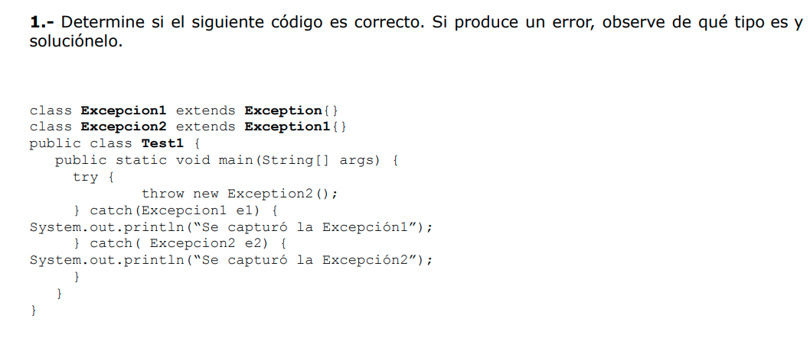
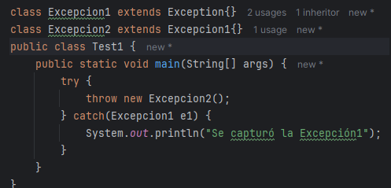
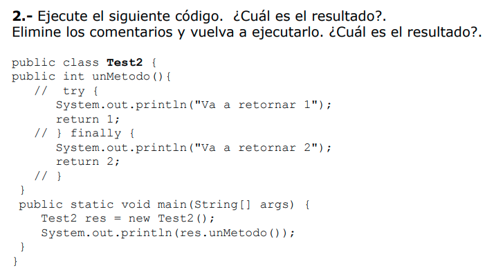
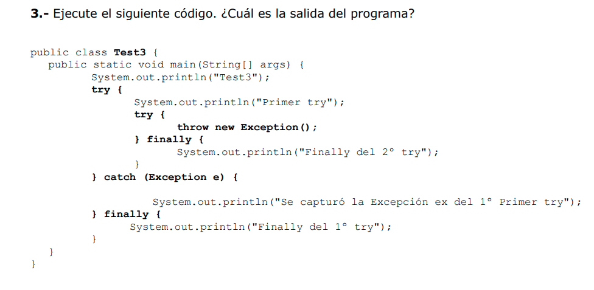
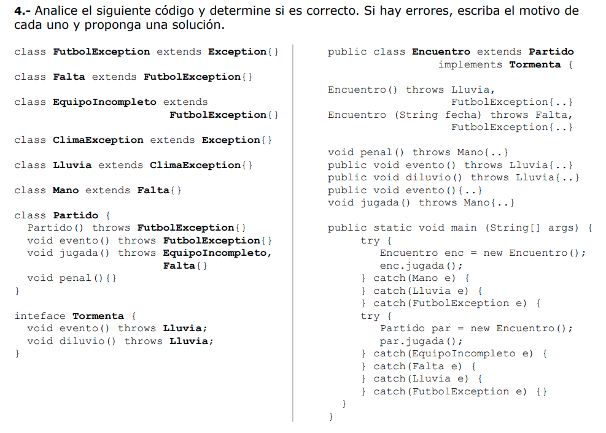

1_ El error surge porque la excepción ya está catcheada. Al "Exception2" ser hija de Exception1 cuando se catchee la Excepcion1 se va a catchear la Excepcion2
 
Así quedaria:

2_ Sin borrar los comentarios tira un error en compilación luego del "return 1" porque nunca se va a ejecutar lo que sigue después.

Cuando se borran los comentarios, se ejecutan los 2 println del "unMetodo()" y el main imprime 2.

3_ Imprime: 
 
"Test3"
 
"Primer try"
 
"Finally del 2º try"
 
"Se capturó la Excepción ex del 1º Primer try"
 
"Finally del 1º try"

4_ 