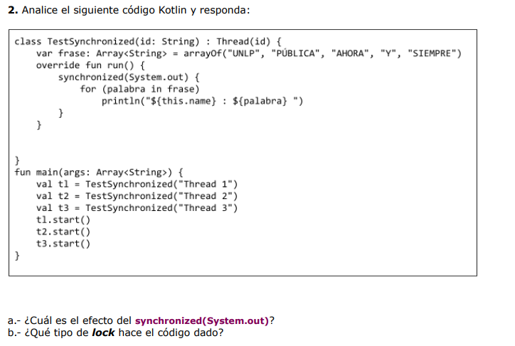

2_a_ El syncronized (System.out) hace que solo un thread a la vez puede acceder al bloque dentro del syncronized, por lo que cada thread que entre imprimirá todos los strings de la lista antes de que otro comience a imprimir. 

2_b_ El lock es el objeto pasado por parámetro al synchronized(), este objeto es utilizado como monitor. Cuando un thread ingresa al bloque marcado como synchronized(), toma el lock, asegurando que otros threads no puede tomarlo y se bloqueen hasta que el lock sea liberado.